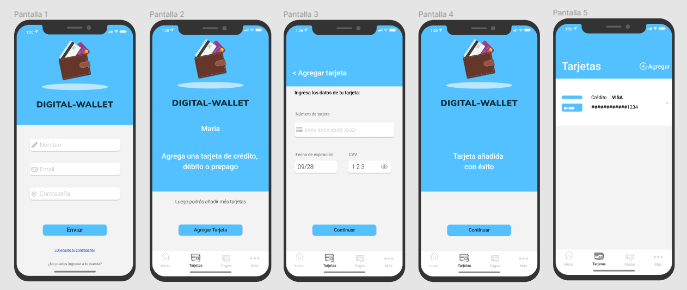
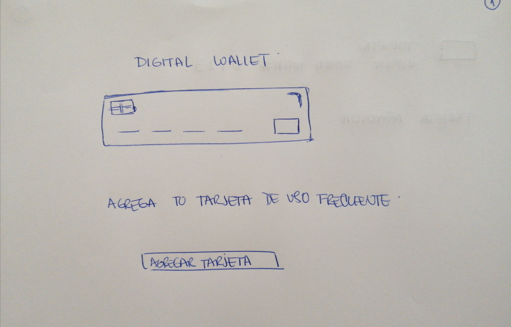
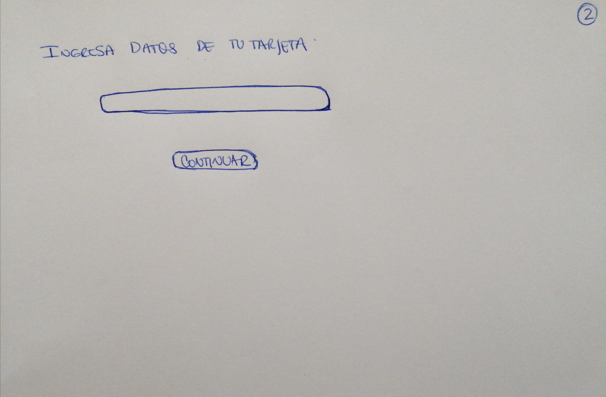
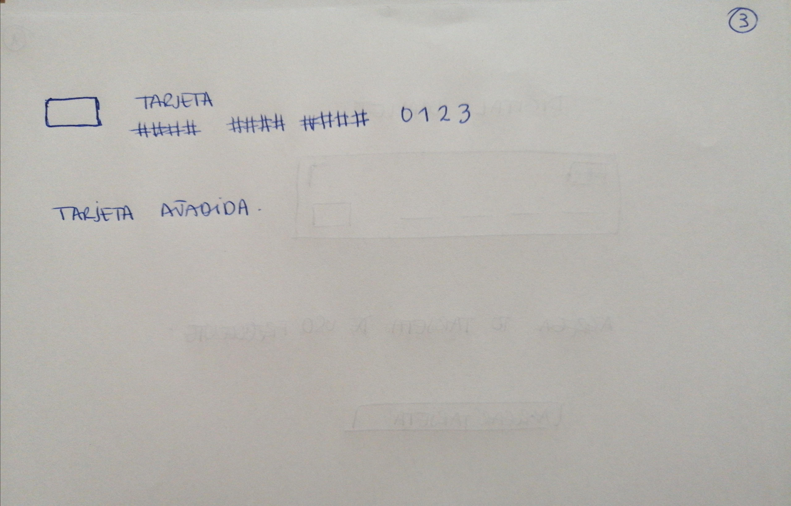

# Digital Wallet 💳

## Índice

* [1. Resumen del proyecto](#1-resumen-del-proyecto-📝)
* [2. Definición del prducto](#2-definición-del-producto-♻️)
* [3. Tecnologías implementadas](#3-tecnologías-implementadas-🛠️)

***

## 1. Resumen del proyecto 📝

Digital Wallet es un monedero virtual que permite al usuario almacenar los datos de sus tarjetas para evitar que deba ingresar sus datos de manera recurrente al realizar compras electrónicas.

Para la validación del número de tarjeta se empleo el [algoritmo de Luhn](https://es.wikipedia.org/wiki/Algoritmo_de_Luhn),
también llamado algoritmo de módulo 10 y se implemento funcionalidad para ocultar todos los dígitos de la tarjeta menos
los últimos cuatro a través de una función llamada maskify.

## 2. Definición del producto ♻️

 Es usual en el comercio electrónico que se presenten inconvenientes para realizar compras efectivas debido a errores de identificación al momento de realizar el pago, esto generalmente tiene como consecuencia que el usuario experimente una sensación de desagrado y desista de realizar la compra. 
 
 El objetivo principal de Digital Wallet es ofrecer a todos los usuarios del comercio electrónico, un sistema que les permita almacenar los datos de todas sus tarjetas, para que puedan realizar sus compras de manera rápida y eficiente sin tener que transcribir nuevamente todos sus datos. 

 Se realizaron los primeros bocetos, tomando como característica principal una interfaz sencilla e intuitiva. 
 
 _A continuación se muestran los primeros Sketches:_

### PROTOTIPO INICIAL

  ___Pantalla Principal___

 

 ___Pantalla Validación___

 

 ___Pantalla Maskify___

 

Luego de relizar feedback con diferentes usuarios se realizo una nueva estrategia de diseño más atractiva y con mayor interacción donde se simula una app móvil con distintas pantallas que muestran diferentes mensajes entre cada proceso.

_A continuación se muestra el ( [Prototipo Final](https://www.figma.com/file/9vaPSCzMPMRIxIzOJA3okV/Digital-Wallet?node-id=0%3A1) ) realizado en Figma:_

### PROTOTIPO FINAL
  
  
  
  ( [Prototipo Final](https://mariannyg.github.io/SCL017-card-validation/?#) )

## 3. Tecnologías implementadas 🛠️

* HTML
* CSS 
* JavaScript
* Figma 
